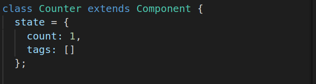
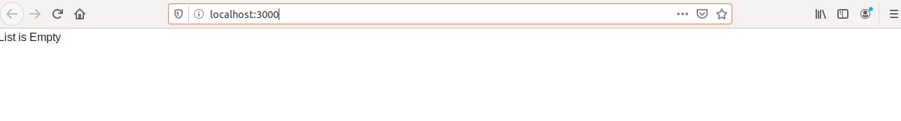
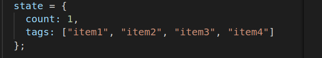
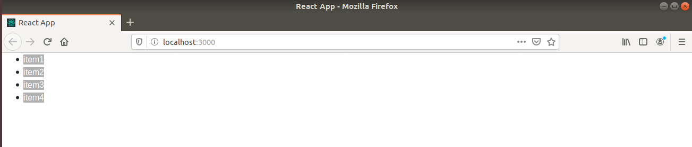

# Rendering List

There are some cases when we want to render content dynamically based upon conditional preference.

This code renders a paragragh if the list is empty.

But if list contains datait renders HTML list,

