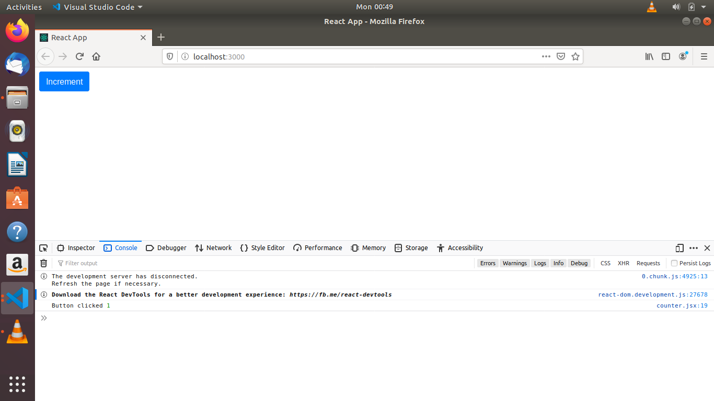

# Binding Event handeler

This allows us to access the properties of class e.g state, inside the event handleing function. Event handeling function is part of object it is an independent function called on the time of event handeling. Binding process binds it with the object.

Here are two methonds to do this.

1. Binding function in constructor

```
  constructor() {
    super();

    // Binding process
    this.buttonClick = this.buttonClick.bind(this);
  }
```

2. Using "Arrow function"

```
  buttonClick = () => {
    console.log("Button clicked", this.state.count);
  };
```

Output of binding function.

