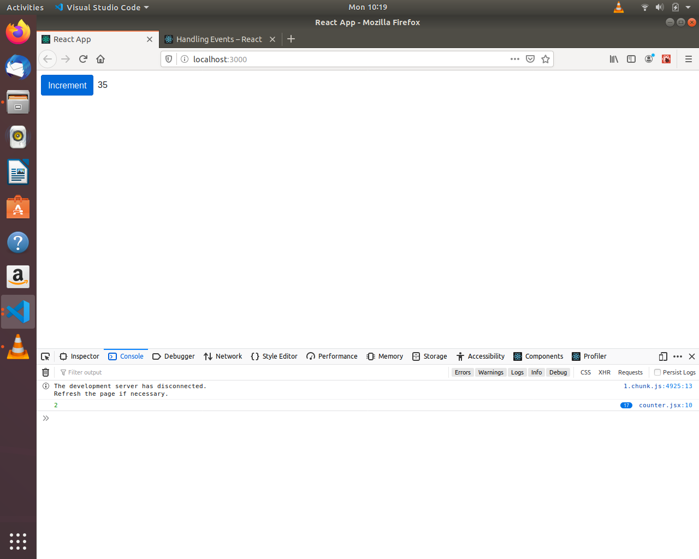

# Updating State

Updating the state from Event handeling funtions. In this case clicking on button will increment the the count in span.



Here are two steps Tward doing this.

1. Simple state updating

```
// FUNCTION- which is updating state
  buttonClick() {
    this.setState(state => ({
      count: this.state.count + 1
    }));
  }

// CALL- in JSX
<button onClick={this.buttonClick.bind(this)}>

________________________________________________
// Using arrow function

// FUNCTION- which is updating state
buttonClick = () => {
  this.setState(state => ({
    count: this.state.count + 1
  }));
}

// CALL- in JSX
<button onClick={this.buttonClick}>


```

2. Using "Arrow function"

```
// Function- with parameter
buttonClick(hello) {
  console.log(hello);
  this.setState(state => ({
    count: this.state.count + hello
  }));
}

//CALL- call with parameter
<button onClick={this.buttonClick.bind(this, 2)}>
```
